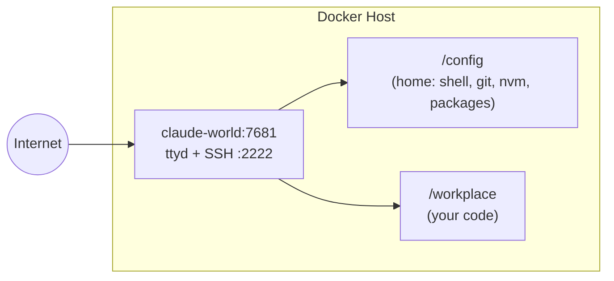

<p align="center">
  
</p>

<h1 align="center">Claude World</h1>

<p align="center">
  <a href="https://github.com/Piero24/Claude-World/stargazers"></a>
  <a href="https://github.com/Piero24/Claude-World/blob/main/LICENSE"></a>
  <a href="https://github.com/Piero24/Claude-World"></a>
  <a href="https://github.com/Piero24/Claude-World"></a>
</p>

<p align="center">
  One container, one terminal. SSH in and Claude is ready.
</p>

---

```bash
curl -fsSL https://raw.githubusercontent.com/Piero24/Claude-World/main/install.sh | bash
```

## What's inside

| Service | Image | Purpose |
|---------|-------|---------|
| **dev** | `linuxserver/baseimage-ubuntu:noble` | Web terminal (ttyd) + SSH + all dev tools |
| **beszel-agent** | `henrygd/beszel-agent:latest` | System metrics → your existing Beszel hub |

Pre-installed: nvm + Node LTS, Claude Code, Python 3, Java, Docker CLI, GitHub CLI (gh), build-essential, tmux, zsh.

## Architecture



One container, everything in one place. `/config` is your persistent home: shell config, git identity, nvm, Node, Claude Code, all survive container rebuilds. `/workplace` is your code.

## Quickstart

### CasaOS

```bash
curl -fsSL https://raw.githubusercontent.com/Piero24/Claude-World/main/install.sh | bash
```

The installer asks where to store data, downloads everything, then prints next steps.

### Plain Docker

```bash
git clone https://github.com/Piero24/Claude-World.git
cd Claude-World

# Create the persistent directories
mkdir -p config workplace

# Edit values in compose.yaml, then:
docker compose up -d
```

## Access

| Method | URL / Command | Auth |
|--------|---------------|------|
| Web terminal | `http://<server-ip>:7681` | `PASSWORD`, Claude auto-launches |
| SSH | `ssh abc@<server-ip> -p 2222` | `SUDO_PASSWORD`, Claude auto-launches |

## Key features

- **One container for dev**: web terminal + SSH. No desktop, no separate VS Code
- **Claude auto-launch**: connect via SSH or web terminal and Claude is ready in `/workplace`. Exit Claude to get a shell prompt
- **Monitoring**: Beszel agent feeds system metrics to your existing hub
- **Web terminal (ttyd)**: full bash shell in your browser, password-protected
- **SSH access**: connect from local devices like PC, Mac, or iPhone
- **Persistent tmux sessions**: your work survives disconnects and app switches, especially useful on mobile
- **Configurable cleanup**: `TMUX_TIMEOUT` auto-kills detached sessions after N hours, `tmux-keep` overrides it
- **Persistent packages**: everything in `/config` survives container rebuilds
- **No Mac required**: work entirely from a browser and SSH

## Tools pre-installed

| Tool | Installed by | Persists? |
|------|-------------|-----------|
| nvm + Node LTS | Init script | ✅ `/config/.nvm` |
| Claude Code | Init script (npm global) | ✅ `/config/.npm-global` |
| Python 3 + pip | Init script (apt) | ❌ Reinstalled each boot |
| Java (default-jdk) | Init script (apt) | ❌ Reinstalled each boot |
| Docker (DinD) | Init script (apt + internal daemon) | ❌ Reinstalled each boot |
| GitHub CLI (gh) | Init script (apt) | ❌ Reinstalled each boot |
| build-essential | Init script (apt) | ❌ Reinstalled each boot |
| Git, curl, zsh, tmux, nano | Init script (apt) | ❌ Reinstalled each boot |

:::tip[The golden rule]
If it lands in `/config`, it persists forever. If it needs `sudo` or `apt`, add it to the init script.
:::

## Files

| File | Purpose |
|------|---------|
| [`compose.yaml`](compose.yaml) | Plain Docker Compose (short syntax, relative paths) |
| [`compose-casaos.yaml`](compose-casaos.yaml) | CasaOS Compose (long syntax, `x-casaos` metadata) |
| [`init.sh`](init.sh) | Container boot script: SSH, ttyd, nvm, Node, Claude Code |
| [`install.sh`](install.sh) | Interactive CasaOS installer |

## Docs

Full documentation at [`cloud-dev-docs/`](cloud-dev-docs/):

- [Overview & Architecture](cloud-dev-docs/docs/index.mdx)
- [Server Setup](cloud-dev-docs/docs/server-setup.mdx): Docker or CasaOS
- [Daily Workflow](cloud-dev-docs/docs/daily-workflow.mdx): tmux, persistent sessions, Termius
- [Persistence](cloud-dev-docs/docs/persistence.mdx)
- [Environment Variables](cloud-dev-docs/docs/env-vars.mdx): full reference

## Requirements

- Docker + Docker Compose
- That's it

## License

MIT: see [LICENSE](LICENSE).
