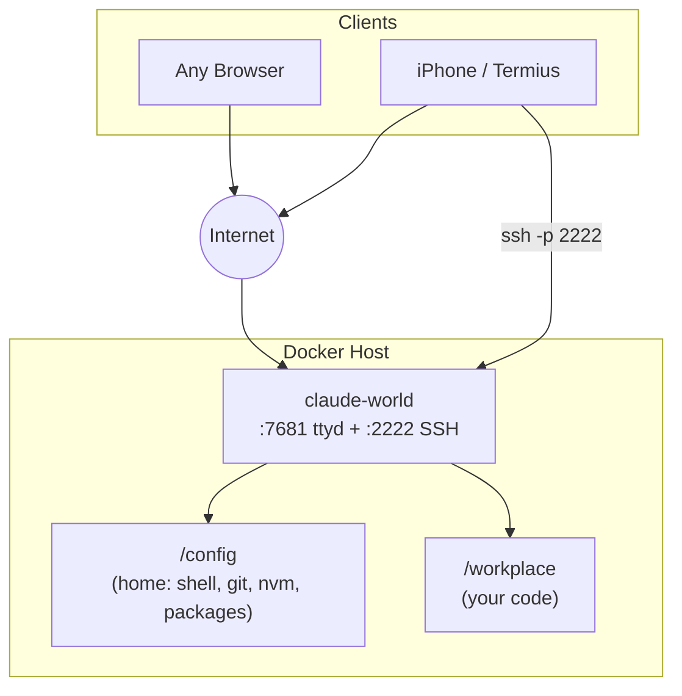

# Claude World

A single-container cloud development environment with web terminal and SSH, everything in one place.

## What You Get

- **Claude auto-launches on connect**: open a web terminal or SSH in and Claude is ready in `/workplace`, no setup needed
- **Web terminal in your browser**: full bash shell via ttyd, password-protected, from any device
- **SSH access**: connect from local devices like PC, Mac, or iPhone
- **Persistent tmux sessions**: your work survives disconnects and app switches, especially useful on mobile
- **Everything in one container**: no desktop, no separate VS Code, no extra services

:::tip[Just want a shell?]
Set `NO_CLAUDE=1` to skip the auto-launch: `NO_CLAUDE=1 ssh abc@<server> -p 2222`
:::

## Why Claude World?

Claude World is designed around two core ideas: providing an isolated sandbox for agentic coding and enabling a remote, developer-first environment.

### A Sandbox for Agentic Coding
Agentic tools like Claude Code can run terminal commands, write scripts, and edit files automatically. Giving them direct access to your primary system carries risks. Claude World solves this by creating a dedicated, safe environment:
- **Complete isolation**: Claude executes instructions inside a Docker container, keeping your host system completely untouched.
- **Worry-free operation**: You can let Claude install dependencies, run scripts, and configure system tools without fearing accidental system modifications.
- **Easy environment recovery**: If Claude misconfigures a tool or breaks a package, you can simply recreate the container to start fresh, while your actual project code remains untouched in the mounted workspace.

### A Remote, Developer-First Environment
Running heavy agent loops and compilation tasks locally drains laptop batteries and slows down machines. Claude World uses Docker Compose to run Claude Code on remote infrastructure:
- **Develop from any device**: Use the browser-based web terminal or SSH to work from your PC, Mac, or even an iPad on the go.
- **Offload resource usage**: Let a remote home server or cloud instance run the resource-intensive compilations, unit tests, and continuous agent runs.
- **Continuous, persistent state**: Combined with tmux, your terminal session survives bad connections, app swaps, and device switches, allowing you to pick up exactly where you left off.

## Architecture

One container, one shared environment:



## How it works

```
compose.yaml          init.sh              /config (persistent home)
(dev service)     →   on boot  →          ├── .bashrc / .zshrc
                                           ├── .gitconfig
                                           ├── .nvm (Node LTS)
                                           └── .npm-global (Claude Code)
```

Edit `compose.yaml`, recreate the container, changes take effect on next boot.

## Tools pre-installed

| Tool | Installed by | Persists? |
|------|-------------|-----------|
| nvm + Node LTS | Init script | ✅ `/config/.nvm` |
| Claude Code | Init script (npm global) | ✅ `/config/.npm-global` |
| Python 3 + pip | Init script (apt) | ❌ Reinstalled each boot |
| Java (default-jdk) | Init script (apt) | ❌ Reinstalled each boot |
| Docker (DinD) | Init script (apt + internal daemon) | ❌ Reinstalled each boot |
| GitHub CLI (gh) | Init script (apt) | ❌ Reinstalled each boot |
| build-essential (gcc, make) | Init script (apt) | ❌ Reinstalled each boot |
| Git, curl, zsh, tmux, nano | Init script (apt) | ❌ Reinstalled each boot |
| ttyd | Init script (download) | ✅ `/usr/local/bin/ttyd` |

:::tip[The golden rule]
If it lands in `/config`, it persists forever. If it needs `sudo` or `apt`, add it to the init script.
:::

## Next steps

- **[Server Setup](./server-setup)**: get the container running (Docker or CasaOS)
- **[Daily Workflow](./daily-workflow)**: tmux, persistent sessions, Termius
- **[Persistence](./persistence)**: what survives rebuilds and what doesn't
- **[Environment Variables](./env-vars)**: full reference for all configurable vars
