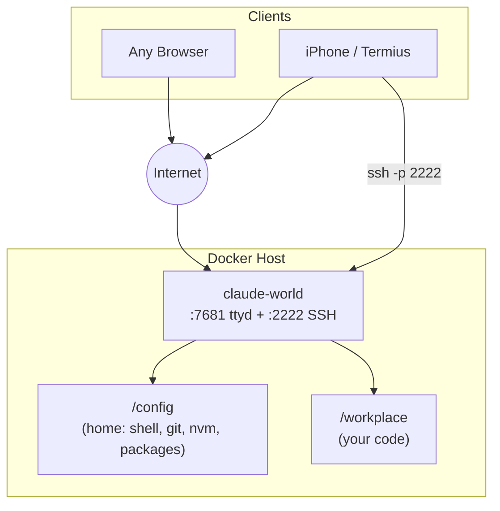

# Claude World

A single-container cloud development environment — web terminal + SSH, everything in one place.

## What You Get

- **Web terminal in your browser** — full bash shell via ttyd, password-protected, from any device
- **SSH access** — connect from Mac, PC, or phone (iPhone/Termius with persistent tmux)
- **Everything in one container** — no desktop, no separate VS Code, no extra services

## Architecture

One container, one shared environment:



## How it works

```
compose.yaml          init.sh              /config (persistent home)
(dev service)     →   on boot  →          ├── .bashrc / .zshrc
                                           ├── .gitconfig
                                           ├── .nvm (Node LTS)
                                           └── .npm-global (Claude Code)
```

Edit `compose.yaml` → recreate the container → changes take effect on next boot.

## Tools pre-installed

| Tool | Installed by | Persists? |
|------|-------------|-----------|
| nvm + Node LTS | Init script | ✅ `/config/.nvm` |
| Claude Code | Init script (npm global) | ✅ `/config/.npm-global` |
| Python 3 + pip | Init script (apt) | ❌ Reinstalled each boot |
| Java (default-jdk) | Init script (apt) | ❌ Reinstalled each boot |
| Docker CLI | Init script (apt) | ❌ Reinstalled each boot |
| build-essential (gcc, make) | Init script (apt) | ❌ Reinstalled each boot |
| Git, curl, zsh, tmux, nano | Init script (apt) | ❌ Reinstalled each boot |
| ttyd | Init script (download) | ✅ `/usr/local/bin/ttyd` |

:::tip[The golden rule]
If it lands in `/config`, it persists forever. If it needs `sudo` or `apt`, add it to the init script.
:::

## Next steps

- **[Server Setup](./server-setup)** — get the container running (Docker or CasaOS)
- **[Daily Workflow](./daily-workflow)** — tmux, persistent sessions, Termius
- **[Persistence](./persistence)** — what survives rebuilds and what doesn't
- **[Environment Variables](./env-vars)** — full reference for all configurable vars
